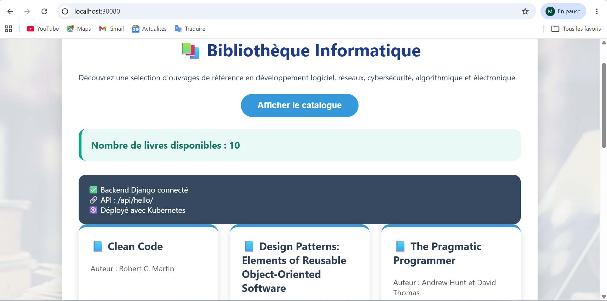
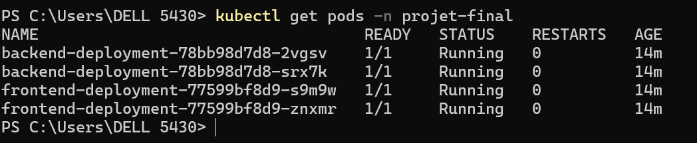
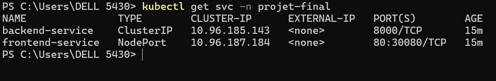
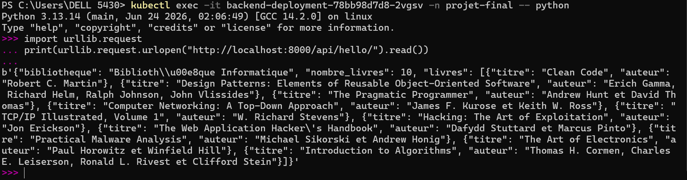

# Projet Final Kubernetes — Bibliothèque Informatique

## 1. Présentation

Ce projet consiste à concevoir, conteneuriser et déployer une application web complète sur Kubernetes composée de deux services :

* un **backend Django** exposant une API REST ;
* un **frontend HTML/JavaScript** servi par **Nginx**.

L'application représente une bibliothèque informatique permettant d'afficher un catalogue de livres spécialisés dans :

* le développement logiciel ;
* les réseaux informatiques ;
* la cybersécurité ;
* les algorithmes ;
* l'électronique.

Le frontend consomme l'API Django grâce au Service Kubernetes interne `backend-service`.

---

# 2. Architecture de l'application

```
                         Navigateur

                              |
                              |
                 http://localhost:30080

                              |
                              v

              +-----------------------------+
              | frontend-service            |
              | Type : NodePort             |
              | Port : 30080                |
              +-----------------------------+

                              |
                              v

              +-----------------------------+
              | frontend-deployment         |
              | 2 Pods                      |
              | Nginx + HTML/JavaScript     |
              +-----------------------------+

                              |
                              |
                 Appel API interne DNS

                 http://backend-service:8000

                              |
                              v

              +-----------------------------+
              | backend-service              |
              | Type : ClusterIP             |
              | Port : 8000                  |
              +-----------------------------+

                              |
                              v

              +-----------------------------+
              | backend-deployment           |
              | 2 Pods                       |
              | Django API                   |
              +-----------------------------+
```

Le frontend ne communique jamais directement avec l'adresse IP d'un pod.

La communication entre les services utilise le DNS interne Kubernetes :

```
http://backend-service:8000
```

---

# 3. Création du cluster Kubernetes

Le projet utilise un cluster Kubernetes local basé sur **Kind**.

Le fichier de configuration utilisé est :

```
kind-config.yaml
```

Il permet d'exposer le NodePort 30080 vers la machine locale.

Création du cluster :

```bash
kind create cluster --name projet-final --config kind-config.yaml
```

---

# 4. Construction des images Docker

Le projet contient deux images Docker indépendantes :

```
django-backend:latest
frontend-app:latest
```

Chaque service possède son propre Dockerfile.

---

## 4.1 Backend Django

Technologies utilisées :

* Python ;
* Django.

Dockerfile :

```dockerfile
FROM python:3.13-slim
```

Construction :

```bash
cd app/backend

docker build -t django-backend:latest .
```

Chargement de l'image dans Kind :

```bash
kind load docker-image django-backend:latest --name projet-final
```

---

## 4.2 Frontend Nginx

Technologies utilisées :

* HTML ;
* JavaScript ;
* Nginx Alpine.

Dockerfile :

```dockerfile
FROM nginx:alpine
```

Construction :

```bash
cd app/frontend

docker build -t frontend-app:latest .
```

Chargement dans Kind :

```bash
kind load docker-image frontend-app:latest --name projet-final
```

---

# 5. Déploiement Kubernetes

Les manifests Kubernetes sont disponibles dans :

```
k8s/
```

Déploiement complet :

```bash
kubectl apply -f k8s/
```

Les ressources créées sont :

* Namespace `projet-final`
* Backend Deployment
* Backend Service
* Frontend Deployment
* Frontend Service
* ConfigMap frontend

---

# 6. Vérification du déploiement

## Vérification des pods

Commande :

```bash
kubectl get pods -n projet-final
```

Résultat attendu :

```
backend-deployment-xxxxx      1/1   Running
backend-deployment-xxxxx      1/1   Running

frontend-deployment-xxxxx     1/1   Running
frontend-deployment-xxxxx     1/1   Running
```

Le déploiement respecte les contraintes :

* 2 replicas backend ;
* 2 replicas frontend ;
* readinessProbe ;
* livenessProbe ;
* resources requests ;
* resources limits.

---

## Vérification des Services

Commande :

```bash
kubectl get svc -n projet-final
```

Résultat attendu :

```
backend-service      ClusterIP     8000/TCP

frontend-service     NodePort      80:30080/TCP
```

Le backend est accessible uniquement dans le cluster.

Le frontend est exposé vers l'extérieur via le NodePort 30080.

---

# 7. Accès à l'application

Le frontend est accessible via :

http://<IP_NOEUD>:30080

Dans un environnement Kind avec Docker Desktop :
http://localhost:30080

Après ouverture de la page :

1. l'utilisateur clique sur le bouton **Afficher le catalogue** ;
2. le frontend effectue un appel vers l'API Django ;
3. les données JSON retournées sont affichées sous forme de cartes de livres.

---

# 8. API Backend Django

Le backend expose deux endpoints.

---

## Endpoint métier

Route :

```
GET /api/hello/
```

Retourne le catalogue des livres au format JSON.

Exemple :

```json
{
  "bibliotheque": "Bibliothèque Informatique",
  "nombre_livres": 10,
  "livres": [
    {
      "titre": "Clean Code",
      "auteur": "Robert C. Martin"
    }
  ]
}
```

---

## Endpoint Health Check

Route :

```
GET /api/health/
```

Réponse :

```json
{
  "status": "UP"
}
```

Cet endpoint est utilisé par Kubernetes pour :

* readinessProbe ;
* livenessProbe.

---

# 9. Vérification de l'API Backend

Le conteneur backend ne contient pas la commande `curl`.

Le test est donc effectué directement avec Python :

```bash
kubectl exec -it backend-deployment-xxxxx -n projet-final -- python
```

Puis :

```python
import urllib.request

print(
    urllib.request.urlopen(
        "http://localhost:8000/api/health/"
    ).read()
)

print(
    urllib.request.urlopen(
        "http://localhost:8000/api/hello/"
    ).read()
)
```

Les réponses retournent :

* le statut de santé du backend ;
* le catalogue JSON des livres.

---

# 10. Fonctionnalités réalisées

Le projet respecte le cahier des charges :

✅ Backend Django avec endpoint métier `/api/hello/`

✅ Endpoint health check `/api/health/`

✅ Frontend HTML/JavaScript consommant l'API

✅ Deux Dockerfiles distincts

✅ Images Docker séparées

✅ Namespace Kubernetes dédié

✅ Deployment backend

✅ Deployment frontend

✅ Service backend de type ClusterIP

✅ Service frontend de type NodePort

✅ Communication interne via DNS Kubernetes

✅ Deux replicas backend

✅ Deux replicas frontend

✅ Readiness Probe

✅ Liveness Probe

✅ Resources Requests et Limits

✅ Configuration via ConfigMap

---

# 11. Structure du projet

```
projet-final/

├── app/
│   ├── backend/
│   │   ├── Dockerfile
│   │   ├── requirements.txt
│   │   ├── manage.py
│   │   └── api/
│   │
│   └── frontend/
│       ├── Dockerfile
│       ├── index.html
│       ├── nginx.conf
│       ├── config.js
│       └── images/
│           └── bibliotheque.jpg
│
├── k8s/
│   ├── 00-namespace.yaml
│   ├── 01-backend-deployment.yaml
│   ├── 02-backend-service.yaml
│   ├── 03-frontend-deployment.yaml
│   ├── 04-frontend-service.yaml
│   └── frontend-configmap.yaml
│
├── images/
│   ├── capture-application.png
│   ├── capture-pods.png
│   ├── capture-services.png
│   └── capture-api.png
│
├── kind-config.yaml
│
└── README.md
```

---

# 12. Captures d'écran

## Application fonctionnelle

L'application est accessible depuis :

```
http://localhost:30080
```

Elle affiche le catalogue des livres récupéré depuis le backend Django.



---

## Pods Kubernetes

Commande utilisée :

```bash
kubectl get pods -n projet-final
```



---

## Services Kubernetes

Commande utilisée :

```bash
kubectl get svc -n projet-final
```

La capture montre :

* `backend-service` en ClusterIP ;
* `frontend-service` en NodePort.



---

## Test API Backend

La capture montre les réponses des endpoints :

```
/api/health/
```

et

```
/api/hello/
```



---

# Conclusion

Ce projet met en œuvre une architecture web complète basée sur Kubernetes avec :

* séparation frontend/backend ;
* images Docker dédiées ;
* communication interne via Service ClusterIP ;
* exposition externe via NodePort ;
* probes de santé Kubernetes ;
* réplication des pods ;
* gestion de configuration via ConfigMap.

L'application finale est accessible sans port-forward grâce au Service Kubernetes :

```
http://localhost:30080
```